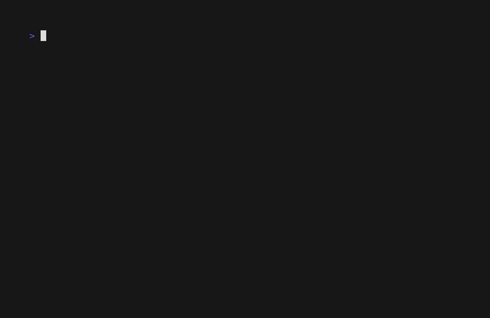

# Goose TUI Calculator

A retro-styled terminal user interface calculator built with Go and Bubble Tea.

*Work in progress.*

## Project Requirements

An initial requirements and scope document is maintained in [docs/requirements.md](docs/requirements.md). This captures:
- Core technology choices
- Functional & non-functional scope
- Testing & CI/CD strategy
- Visual demo (vhs) workflow
- Roadmap / backlog placeholders

Issue tracking the requirements document: See Issue #4.

## Contributing

We follow an **Issue → Branch → Code + Tests → VHS Demo → PR** workflow.

Key points:
- Every feature or bug fix starts with an issue.
- UI or behavior changes require updating/adding a VHS tape and regenerated GIF.
- PRs must include Before / After GIF sections (or mark Before as N/A).
- See [CONTRIBUTING.md](CONTRIBUTING.md) and detailed [development workflow](docs/development-workflow.md).

If you want to propose a feature, open a *Feature Request* issue (template provided).

---
Visual demos are treated as versioned artifacts to keep reviews fast and transparent.
See demo history: [docs/demo-history.md](docs/demo-history.md)
