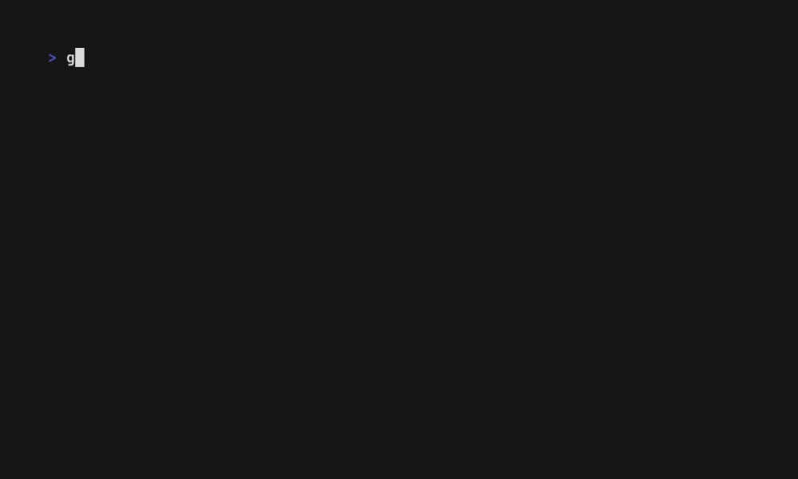

# Goose TUI Calculator 🪿

A Casio-style terminal user interface calculator built with Go and Bubble Tea, featuring the Goose logo and authentic retro LCD design.

*Work in progress.*

## Features

### Casio-Style Design with Goose Branding
Authentic calculator appearance inspired by classic Casio calculators:

- **Dual Goose Logo 🪿** - Distinctive dual goose branding (🪿 GOOSE 🪿) at the top
- **Green LCD Display** - Authentic dark green background with light green text
- **Perfect Alignment** - Display and button grid precisely aligned at 24 chars
- **Rich Color Scheme** - Distinct colors for different key types:
  - AC: Red for clear action
  - Numbers (1-9): Dark gray
  - Zero (0): Darker blue-gray for emphasis
  - Operators (+, -, x, /): Orange
  - Equals (=): Bright orange to highlight action
  - Functional keys (+/-, %, .): Light gray
- **Casio Aesthetics** - Clean layout with proper borders
- **Simplified Help** - Essential information only: "Press q or esc to quit"

### Previous Operation Display
The calculator shows your previous operation on a second line above the current input:

- **Operation tracking** - See "2 +" while entering the second operand
- **Full history** - View complete calculation "2 + 3 = 5" after pressing equals
- **Right alignment** - Both history and current values align to the right
- **Clear integration** - AC button clears both lines for fresh start

### Enhanced Visual Feedback
Advanced visual feedback system that distinguishes between different input methods:

- **Navigation highlighting** - Gold background when navigating with arrow keys
- **Navigation activation** - Orange-red background when pressing Enter/Space or clicking
- **Direct keyboard input** - Blue/purple background when typing numbers/operators directly
- **Timed feedback** - Visual feedback automatically clears after 300ms
- **Complete accessibility** - Clear visual distinction between all interaction methods
- **Multi-input support** - Seamless switching between navigation and direct input

## Project Requirements

An initial requirements and scope document is maintained in [docs/requirements.md](docs/requirements.md). This captures:
- Core technology choices
- Functional & non-functional scope
- Testing & CI/CD strategy
- Visual demo (vhs) workflow
- Roadmap / backlog placeholders

Issue tracking the requirements document: See Issue #4.

## Contributing

We follow an **Issue → Branch → Code + Tests → VHS Demo → PR** workflow.

Key points:
- Every feature or bug fix starts with an issue.
- UI or behavior changes require updating/adding a VHS tape and regenerated GIF.
- CI re-renders the baseline VHS demo on every PR and attaches the `vhs-demos` artifact so reviewers can download the latest GIF.
- PRs must include Before / After GIF sections (or mark Before as N/A).
- See [CONTRIBUTING.md](CONTRIBUTING.md) and detailed [development workflow](docs/development-workflow.md).

If you want to propose a feature, open a *Feature Request* issue (template provided).

---
Visual demos are treated as versioned artifacts to keep reviews fast and transparent.
See demo history: [docs/demo-history.md](docs/demo-history.md)
